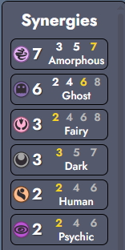
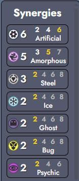

# Amorphous Synergy Guide

Boards

<h3>Pyukumuku Water Adds</h3>

  
  

<h3>Castform Water Adds</h3>

  
  

<h3>Ghost Amorphous</h3>

  
  

<h3>Poison Amorphous</h3>

  
  

<h3>Castform Koffing Artificial</h3>

  
  

 

Tips and Tricks

 
<h3>Early Game</h3>
<ul>
  <li>Don't force Amorphous early - the synergy provides very little benefit in early rounds</li>
  <li>Focus on analyzing add picks to plan your transition</li>
  <li>Consider synergy stones more highly than usual, especially Ice Stone</li>
  <li>It's usually better to play a different earlygame comp like bug or ground while collecting useful amorph pokemon and transitioning on t10</li>
</ul>
<h3>Late Game</h3>
<ul>
  <li>Getting on amorph 7 doubles the stat bonus per synergy, so its usually what you want to have in on level 7</li>
  <li>Try to add as many additional synergies as possible on level 8/9 while keeping amorph 7 in</li>
  <li>On level 9 transition into dragon 3 with your two flex slots to maximize synergies. Usually you want to run Gabite + Vibrava to dig holes and add an additional unit to get the buff</li>
</ul>

Add Picks

 
<h3>Uncommon Adds</h3>
<ul>
  <li><b>Grimer</b> - Poison; Dark potential with Spiritomb + Darkrai region (watch for Gulpin epic add)</li>
  <li><b>Koffing</b> - Poison; Artificial with Castform unique (check artifact item early!)</li>
  <li><b>Omanyte</b> - Water; needs Dewpider → Castform/Pyukumuku unique OR water/ground Shellos region</li>
  <li><b>Dewpider</b> - Water (same as Omanyte); Bug with Caterpie</li>
  <li><b>Sandyghast</b> - Ghost; Ground with Silicobra and Water/Ground Shellos region</li>
</ul>

<h3>Rare Adds</h3>
<ul>
  <li><b>Slugma</b> - Fire with Castform unique; Rock with Aquatic/Rock Shellos region and Nihilego legendary</li>
  <li><b>Wynaut/Munna</b> - Psychic with each other, Solosis, or Mew/Deoxys legendary (Baby/Wild irrelevant)</li>
  <li><b>Drifloon</b> - Ghost; Flying overlaps with Butterfree or non-amorphous Pokemon</li>
  <li><b>Silicobra</b> - Ground with Sandyghast</li>
</ul>

<h3>Epic Adds</h3>
<ul>
  <li><b>Misdreavus</b> - Ghost; Fairy with Mimikyu or Milcery unique</li>
  <li><b>Gulpin</b> - Poison with Ghastly; needs Grimer/Koffing add, Pyukumuku unique, or Nihilego legendary</li>
</ul>

<h3>Unique Pokemon</h3>
<ul>
  <li><b>Castform</b> - Synergizes with Slugma, Omanyte/Dewpider, or Koffing adds; Ice with Vanillite backup (better than Cryogonal)</li>
  <li><b>Cryogonal</b> - Only pairs with Vanillite</li>
  <li><b>Spiritomb</b> - Dark synergy with Grimer in Dark/Amorphous regions (needs Darkrai legendary); Ghost option</li>
  <li><b>Pyukumuku</b> - Wants Omanyte/Dewpider; Poison likely workable</li>
  <li><b>Mimikyu</b> - Perfect with Misdreavus; otherwise another ghost</li>
  <li><b>Milcery</b> - Chef combo with Gulpin; Fairy with Misdreavus</li>
</ul>

<h3>Legendary Pokemon</h3>
<ul>
  <li><b>Mew</b> - Always hits Psychic with Reuniclus</li>
  <li><b>Deoxys</b> - Same as Mew, generally superior</li>
  <li><b>Manaphy</b> - Water with Omanyte/Dewpider/Ground-Water Shellos/Pyukumuku; consider water portal backup with 2+ water units; Aquatic options with Tynamo (weak) or Goomy</li>
  <li><b>Darkrai</b> - Excellent synergy overlap with Spiritomb; otherwise Ghost</li>
  <li><b>Nihilego</b> - Rock with Slugma (huge potential); Poison needs only one of Grimer/Koffing/Gulpin/Pyukumuku (Ghastly always available); excellent caster vs Bug/Flora</li>
  <li><b>Melmetal</b> - No synergy overlap, weak choice</li>
</ul>

Synergy Stone Priority

 
<h3>High Value (Almost Always +1 Synergy)</h3>
<ul>
  <li><b>Ice Stone</b> - Always provides extra synergy or allows Vanillite/Cryogonal substitution (awkward with Castform sometimes)</li>
</ul>

<h3>Conditional Value</h3>
<ul>
  <li><b>Fire Stone</b> - Works with Slugma, otherwise useless</li>
  <li><b>Fairy Stone</b> - Works with Misdreavus/Mimikyu/Alcremie (don't buy until after last add pick)</li>
  <li><b>Water Stone</b> - Worth it with 2+ water adds/uniques; maybe worth with just Dewpider pre-unique</li>
  <li><b>Fossil Stone</b> - Good with Omanyte if you're probably playing water as well</li>
  <li><b>Psychic Stone</b> - Always hits with Solosis but can be awkward if you hit a psychic legendary</li>
  <li><b>Dark Stone</b> - Needs 2+ of Dark Grimer/Spiritomb/Darkrai (probably not worth with just Grimer pre-unique)</li>
</ul>

<h3>No Value</h3>
<ul>
  <li><b>Grass Stone</b> - Useless</li>
  <li><b>Electric Stone</b> - Useless</li>
</ul>

