#  Field Synergy Guide 

Boards

<h3>All  add picks with Arceus and  unique</h3>

  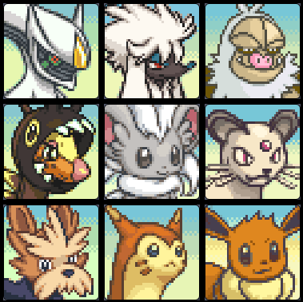
  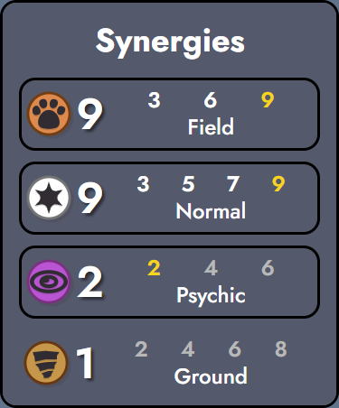

<h3>3 or more  add picks with  unique</h3>

  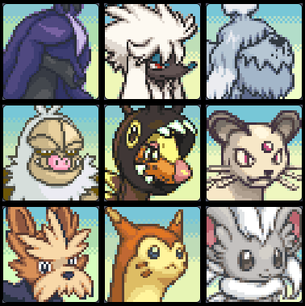
  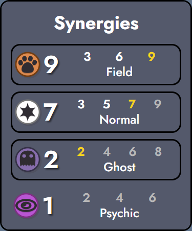

<h3>Electrike, Plusle/Minun, and Thunderstone</h3>

  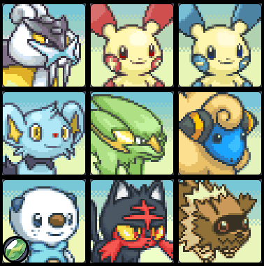
  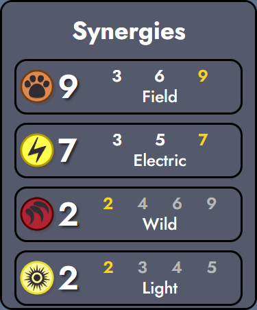

<h3>Electrike, Stantler, and Thunderstone</h3>

  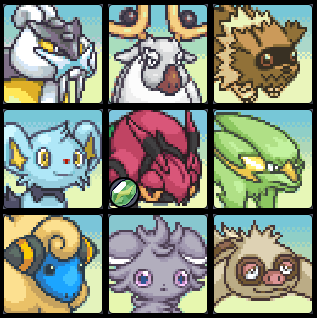
  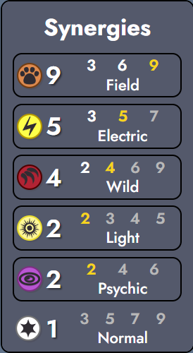

<h3>Both Growlithes, Pontya, Numel region, Heatmor, and Entei</h3>

  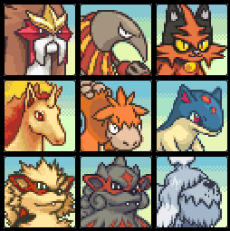
  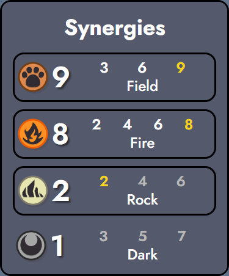

<h3> add picks, Stantler, and Entei</h3>

  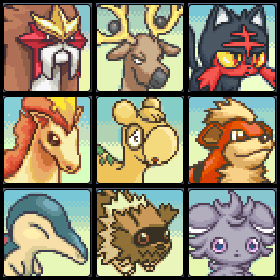
  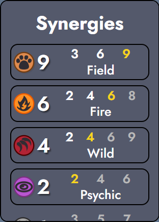

<h3>Both  add picks, Stantler, Spoink region, and Dawnstone</h3>

  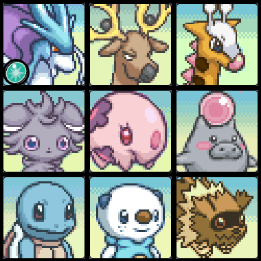
  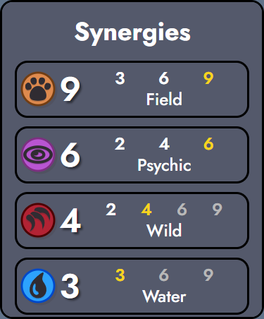

 

Tips and Tricks

<h3>Items</h3>
<ul>
  <li>The  passive gives attack speed and inconsistent healing to your Pokemon. This means that items that give damage, tankiness, and sustain are very good.</li>
  <li>Prioritize Heart Scale (Muscle Band, Flame Orb, Fluffy Tail, Rocky Helmet) and Charcoal (Flame Orb, Red Orb, Shell Bell, Deep Sea Tooth, Punching Glove). Try to get a few of Magnet, Spoon, Ice, Glasses</li>
  <li>Thunderstone is also almost always a useful item to have. If several  or  units are in their stones can be okay too.</li>
  <li>Typically your carries would like at least 1 DPS and tankiness/sustain item.</li>
  

  
Shiny Item Tier List

    <ul>
      <li><b> Shiny Stone</b> - Incredible since you will always be on  in the endgame. Also condsider just pivoting into .</li>
      <li><b> Rare Candy</b> - Stick on a sellable strong add pick Pokemon until you can complete Torracat, Dewott, Vigoroth, Luxio, or Whirlpede. If you get a Scolipede, run a bug.</li>
      <li><b> Absorb Bulb</b> - Triples the EHP of the Pokemon wearing it. Put it on your Legendary/strongest carry. Very weak against pure damage.</li>
      <li><b> Dynamax Band</b> - Strictly worse than Absorb bulb because of the Field healing, but still very good. Put it on your Legendary/strongest carry. Better against Steel, but not burn or poison.</li>
      <li><b> Eviolite</b> - Better stats than Absorb Bulb or Dynamax Band but must go on a no fully evolved Pokemon. Stick it on someone sellable until you can get Torracat, Dewott, Vigoroth, Luxio, or Whirlpede.</li>
      <li><b> Comet Shard</b> - Provides good damage and hopefully kills some stuff at the start. Wants to be on high attack Pokemon. The best ones are Luxray, Scolipede, Samurott, Slaking, Granbull, Suicune, Entei, Raikou, Spectrier, Luxio, Beartic, Whirlpede, Farigiraf, Inciniroar.</li>
      <li><b> Gold Bow</b> - Put it on someone in the front. Another Field is never bad. If you have Venipede on 10 run a Bug.</li>
      <li><b> Repeat Ball</b> - The stats are not super impactful in Field. Probably best to use to try to complete 3 stars. More Field legendaries would be great, but unlikely.</li>
      <li><b> Gold Bottle Cap</b> - Stick on a carry with other crit items. Great on Delibird.</li>
      <li><b> Sacred Ash</b> - Hard to time so that it goes off when at least 4 are dead, but while there are still enough alive to benefit and win. Does not want to be on the last one alive.</li>
      <li><b> White Flute</b> - This item licks goats. Slightly better in Wild 4.</li>
    </ul>
  

  

  
Artificial Item Tier List

    <ul>
      <li><b> Running Shoes</b> - Fit in any non Field unit. Good choices to fit in a Bug, Wild 4, a random ultra that benefits from Field (Porygon, Grookey, Happiny, Teddiursa).</li>
      <li><b> Light Ball</b> - Incredible since you will always be on  in the endgame.</li>
      <li><b> Tiny Mushroom</b> - Incredible once you have Venipede but not especially useful before that. It probably best to duplicate the Venipede since it won't lose max hp.</li>
      <li><b> Exp Share</b> - Great if you have the items for it. You usually want to itemize your legendary and put this on the Pokemon next to it. Also great next to Furfrou. Can copy Psychic AP buff as well. A lot of the uniques are good carriers, notably Miltank. A lot of the strong Field Pokemon have over 25 attack. High defense: Furfrou, Samurott, Incineroar, Camerupt. High SpDef: Spectrier, Grumpig, Camerupt.</li>
      <li><b> Cooking Pot</b> - Need Flame Orb. Incredibly good with Fidough and  Miltank.</li>
      <li><b> Incense</b> - Put this on Mareep to search for Luxios.</li>
      <li><b> Magmarizer</b> - Stick on a bulky carry. Good vs healing comps.</li>
      <li><b> Silk Scarf</b> - Great if you are in Normal. It should go on the Pokemon in the middle of the box.</li>
      <li><b> Metal Coat</b> - Just great defensive stats.</li>
      <li><b> Toxic Orb</b> - Slightly better Flame Orb. Rarely puts you on Poison 3 with Nidoran and Venipede.</li>
      <li><b> Max Elixir</b> - A lot better if in Psychic or have a dedicated caster. Works very well on Stantler, Miltank, and Oshawott.</li>
      <li><b> Air Balloon</b> - Just attack speed and dodge. Gives 11% more EHP.</li>
      <li><b> Electirizer</b> - Attack speed with a mostly useless bonus effect.</li>
      <li><b> Surfboard</b> - Attack speed with a bonus for having Buizel or Chubchoo add picks.</li>
      <li><b> Macho Brace</b> - Gives pretty good damage and the attack speed will not matter after a few stack of Field. Miensfoo and Oshawott give a small bonus.</li>
      <li><b> Pokerus Vial</b> - The effect of this is pretty minor. Put on a Pokemon that will live a while.</li>
      <li><b> Metronome</b> - Pretty good caster item. If you have Minccinno you can put it on one of the many low cost ability Field Pokemon (Zigzagoon, Mienfoo, Ponyta, Snubbull, Buizel, Shinx, Plusle/Minun, Snivy, Scorbunny) to generate attack.</li>
      <li><b> Hard Stone</b> - Just 100 shields unless you have Greavard or Hisuian Growlithe.</li>
      <li><b> Berserk Gene</b> - Just 5 damage. Not worth 10 gold.</li>
      <li><b> Rotom Phone</b> - Does nothing unless you have Greavard or Spectrier.</li>
      <li><b> Explorer Kit</b> - Lets you dig holes with Nidoran, Sentrent, or Numel. If you dug this up, there won't be much else of value in the holes.</li>
    </ul>
  

</ul>
<h3>Early Game</h3>
<ul>
    <li>Region does not really matter pre-unique. Only lets you get spoink. Best to go for a region with few regionals like   or .</li>
  <li>Its usually better to play something else early and pivot into  if the adds are good.</li>
  <li>The early add picks are very important.</li>
  <li>There are 5  add picks. They are Skitty (uncommon), Minccino (uncommon), Meowth (rare), Sentret (rare), and Girafarig (epic). With at least 3 + hitting a / unique you can hit  9  7. If you hit 3 in uncommon/rare, try to get a / unique.</li>
  <li>There are two  add picks. They are Growlithe (uncommon) and Ponyta (epic). If everything is in you can hit  8 with one Firestone or getting both Growlithes.</li>
  <li>The only  add pick is Manectric. It is a big sign to play  .</li>
  <li> has Munna (uncommon) and Girafarig (epic). It also relies on you hitting Stantler, picking up up Espurr on a PvE round, and being in  or  region for Spoink. Its worth putting in if the pieces come together, but hard to aim for.</li>
  <li>Hold onto your Mareeps, they will always come in once you have Shinx. Do not itemize them.</li>
  <li>Always buy Espurr and Zigzagoon. Do not itemize them.</li>
</ul>
<h3>Uniques</h3>
<ul>
  <li>Backup portals are  (1/5),  (1/6),  (1/8),  (1/13),  (1/15). Delibird is not good enough to go for.</li>
  <li>Its hard to make more than 1  portal so usually you don't get a choice.</li>
  <li>Plusle/Minun are the high roll, especially if Electrike is in. They can be itemized as casters.</li>
  <li>Stantler is always good. It evolves on t20 into a good lategame carry and gives  2 with 3/4 Legendaries and is a good reason to also look for Zigzagoon and Espurr.</li>
  <li>Heatmor is kind of mediocre but with Growlithe you can stay open to  6 or 8.</li>
  <li>If you have at least 3/4 of the  add picks its good to aim for one of the / uniques. In terms of stats Furfrou > Tauros > Milktank. However Milktank can open up interesting  angles if Fidough is in.</li>
  <li>Delibird is enough of a low roll to consider leaving Field.</li>
</ul>
<h3>Mid Game</h3>
<ul>
  <li>Usually you want to itemize your unique and let it carry you.</li>
  <li>Its very costly to roll, since you always want to go to 9 in this comp.</li>
  <li>Usually its best to run all  units, unless you are splashing a powerful synergy like .</li>
  <li>Once you see the epic add picks its time to evaluate if its worthwhile to go for //.</li>
  <li>If you hit Plusle/Minun or Electrike is in with Thunderstone you can go  5. If both are in you can go  7 with Thunderstone. Always play  if possible.</li>
  <li>For , you always have Cyndaquil and Litten. If you have all of Growlithe add, Ponyta add, Heatmor unique, and Numel region you can always make  6. And Entei + Firestone gets  8. In this case it may be worthwhile to run more  Pokemon over  to start generating shards.</li>
    <li>For , you always have Stantler unique. Espurr is always in but is annoying to get. It is worth running with Stantler alone. If you have 2 of Munna add, Girafarig add, and Spoink region go for  4. If you have all 3 try to get a Dawnstone and put it on your legendary.</li>
  <li>Usually you want to itemize your unique and let it carry you.</li>
  <li>Nickit (rare) and Fidough (rare) are very powerful adds. Fidough should always be given a flame orb and fully itemized.</li>
</ul>
<h3>Legendaries</h3>
<ul>
  <li>Just on stats Spectrier > Entei > Raikou > Suicune. Spectrier also has the superior passive and ability. It has 7% less max hp, the same defense, and double the special defense of the others.</li>
  <li>Raikou is also very good, because you can always get to Electric 3 with it.</li>
  <li>The legendaries always want at least 1 DPS and 1 sustain item. They are also fairly good casters, especially Spectrier.</li>
</ul>
<h3>Late Game</h3>
<ul>
  <li>The lategame is pretty simple. You always need to get to  9. Try to greedy level as much as possible.</li>
  <li>Its usually better to fully itemize a few strong carries with DPS and sustain.</li>
  <li>Watch for opponents that want specific items to counter them, like Rocky Helmet, Assault Vest, or Fluffy Tail.</li>
</ul>

Normal

 
<h3>Normal 9</h3>

  
  

<h3>Normal 7</h3>

  
  

<ul>
  <li>There are 5  add picks. They are Skitty (uncommon), Minccino (uncommon), Meowth (rare), Sentret (rare), and Girafarig (epic).</li>
  <li>With at least 3 + hitting a / unique you can hit  9  7. If you hit 3 in uncommon/rare, try to get a / unique.</li>
  <li>Always play as many / units as possible in a box, with the ranged units in the center.</li>
  <li>Slakoth region is very important to hit. Slaking is a wincon.</li>
  <li>There are 11 Field/Normal Pokemon:
    <ul>
      <li><b>Lillipup</b> - Common. Generic filler</li>
      <li><b>Eevee</b> - Uncommon. Very useful to pick up to use a stone on early. But if it looks like it might be a Normal game, you might need to hold it as an Eevee or use a ditto later.</li>
      <li><b>Skitty</b> - Uncommon add pick. Pretty bad synergy filler.</li>
      <li><b>Minccinno</b> - Uncommon add pick. Decent filler.</li>
      <li><b>Meowth</b> - Rare add pick. Not very strong but worth running for the ability. Itemize as a caster.</li>
      <li><b>Sentret</b> - Rare add pick. Fairly good caster support.</li>
      <li><b>Girafarig</b> - Epic add pick. Very strong caster DPS.</li>
      <li><b>Slakoth</b> - Epic regional. Both evolutions after Slakoth are very powerful. Always wants to be itemized. Can cast.</li>
      <li><b>Tauros</b> - Unique. Pretty good DPS but falls off quickly. Self damage blocked by Protective Pads.</li>
      <li><b>Milktank</b> - Unique. Provides its own defense and damage scaling as a caster. Can solo boards with some sustain. Freinds with Fidough to get HP scaling with Gourmet.</li>
      <li><b>Furfrou</b> - Unique. Self scaling defensive tank. It will get most of its speed back from Field. Really wants Muscle Band.</li>
    </ul>
  </li>
</ul>

Fire

 
<h3>Fire</h3>

  
  

<h3>Fire 6 Wild 4</h3>

  
  

<ul>
  <li>There are 2 Fire add picks. They are Growlithe (uncommon) and Ponyta (epic).</li>
  <li>You always have Cyndaquil and Litten. If you have all of Growlithe add, Ponyta add, Heatmor unique, and Numel region you can always make  6. And Entei + Firestone gets  8.</li>
  <li>If you are close to  8 and have enough health, just put some non  Pokemon in to get  Shards for your carry.</li>
  <li>Camerupt region is very important to hit.</li>
  <li>There are 8 / Pokemon:
    <ul>
      <li><b>Cyndaquil</b> - Uncommon. Pretty decent early ranged unit. If you are in a  region in the midgame could consider Typhlosion.</li>
      <li><b>Growlithe</b> - Uncommon add pick. Pretty decent unit. Regional form is stronger but wants Protective Pads. Very good if you start in  region, since you can get both after midgame. Probably worth rollings some to finish Hisuian Arcanine in early game.</li>
            <li><b>Litten</b> - Epic. Decent but kind of understatted. Ability scales with attack and attack speed.  type is kind of a detriment.</li>
      <li><b>Ponyta</b> - Epic add pick. Very strong, should always be played. Rapidash is much stronger than Heatmor. Great caster, has Entei's ability for half the cost.</li>
      <li><b>Numel</b> - Epic regional. Very bulky and powerful caster. Camerupt is stronger than Heatmor.</li>
      <li><b>Heatmor</b> - Unique. Fairly weak for a unique, don't itemize if you think you want to keep him for the synergy.</li>
      <li><b>Entei</b> - Legendary. Really wants to also be on Wild if possible. Has the strongest ability in Field, but it costs too much.</li>
      <li><b>Scorbunny</b> - Egg mon. Turns into a pretty decent ranged DPS, but has a very good low cost ability. Great reason to get into Field.</li>
    </ul>
  </li>
</ul>

Electric

 
<h3>Electric 7</h3>

  
  

<h3>Electric 5 Wild 4</h3>

  
  

<ul>
  <li>The only  add pick is Electrike (uncommon). It is a huge signal to play Field.</li>
  <li>The only other conditional is if you hit Plusle/Minun and Raikou. If either of these things happen you should try to play  3 or 5.</li>
  <li> 7 is possible if you hit everything and have 1 Thunderstone. This is worth doing, because adding  to a Pokemon is better than most items, but the  7 boost is very minor.</li>
  <li>Mareep and Shinx should be played in all games to get on  2. Put your Legendary or strongest carry in the  spot.</li>
  <li>There are 5 / Pokemon:
    <ul>
      <li><b>Mareep</b> - Common. Pretty weak ranged DPS. Never itemize this, since it will always come back in later with Shinx.</li>
      <li><b>Electrike</b> - Rare add pick. Understated but great typing.</li>
      <li><b>Shinx</b> - Ultra. Incredible carry. If you finish Luxray you should win the game. Always itemize and try to be on at least Electric 3. Can be a caster.</li>
      <li><b>Plusle/Minun</b> - Unique duo. They are identical. Want any items and are good casters.</li>
      <li><b>Raikou</b> - Legendary. Also wants Wild to be in. Hits very fast with Wild and Electric, so really likes damage/tankiness/sustain from items.</li>
    </ul>
  </li>
</ul>

Psychic

 
<h3>Psychic</h3>

  
  

<ul>
  <li>There are 2  add picks. They are Munna (uncommon) and Girafarig (epic).</li>
  <li>The other Pokemon to hit are Espurr (Wild uncommon), Spoink (regional), and Stantler (unique).</li>
  <li>Always pick up Espurr if possible. It is incredible with Stantler, but is also worth playing if you hit a  legendary (3/4).</li>
  <li>After you hit Stantler and see epic add picks, evaluate how many  Pokemon are in. If there are 4, its usually worthwhile to go for  4. If all 5 are in try to make a Dawnstone and put it on your legendary for  6.</li>
  <li>Keep an eye out for useful unknowns to play in PvE rounds.</li>
  <li>There are 5 / Pokemon:
    <ul>
      <li><b>Espurr</b> - Uncommon wild. Pretty mediocre Pokemon, but always take it for synergies later. Not usually worthwhile to roll for on PvE, unless you already have Stantler and know you need it for Psychic. Best friends with Stantler.</li>
      <li><b>Munna</b> - Rare add pick. Reasonable support. Ability gets quite powerful once on some Psychic levels.</li>
      <li><b>Spoink</b> - Rare regional. Spoink is quite weak but Grumpig is fairly good, especially with Psychic levels. Grumpig's ability deals 4x the damage of Spoink.</li>
      <li><b>Girafarig</b> - Epic add pick. Very strong caster DPS.</li>
      <li><b>Stantler</b> - Unique. Best friends with Espurr. Always wants to be itemized. On t20 it gains stats and becomes stronger than any other Field unqiue. Wants some sustain and mana generation.</li>
    </ul>
  </li>
</ul>

