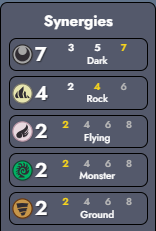

# Dark Synergy Guide

Tips and Tricks

 
<h3>Early Game</h3>
<ul>
  <li>Dark region is very helpful and also enables you to play wild</li>
  <li>Sprigatito is the strongest 1 cost unit in the game. A few copies of it is a huge signal to stay open to dark</li>
  <li>Collect as many Black Glasses as possible. You would like at least one Reaper's Cloth + Scope Lens + crit item combo, and all other crit dps items are great</li>
  <li>Flame orb and Dark Stone are also high value items</li>
  <li>Uncommon add picks are just filler, but rare and epics are very important in vertical dark</li>
  <li>Ideally you fully itemize one early game carry like Sprigatito, Seedot, or an uncommon that you can sell later to repurpose its items.</li>
  <li>The crit cast combo is very powerful, and you will likely want to put it on your legendary or unique, so just slam it early if you get it</li>
  <li>Kleavor is very powerful. Bug is a good backup if you can't get a dark portal. Also worth going for if there are other dark players</li>
  <li>If grimer is added and you are in dark region, hold it in case you get Grimer/Spiritomb/Darkrai</li>
  <li>Morpeko is the best unique if you have crit cast. It will carry every board until the lategame. If you get Galarian Moltres or Darkrai sell it to itemize them, otherwise keep it forever</li>
</ul>
<h3>Mid Game</h3>
<ul>
  <li>Dark is one of the best comps to transition into off the unique portal</li>
  <li>Prioritize getting to level 7 and dark 7</li>
  <li>If you are in dark region and have Absol, consider holding gold to roll down on PvE rounds. You are looking for Rockruff, Galarian Zigzagoon, Poochyena, and Alolan Ratatta</li>
</ul>
<h3>Late Game</h3>
<ul>
  <li>Your carries will usually be some combination of:
    <ul>
      <li><b>Your unique and legendary Pokemon</b></li>
      <li><b>Tyranitar</b></li>
      <li><b>Bisharp</b></li>
      <li><b>Incineroar</b></li>
    </ul>
  </li>
  <li>Galarian Moltres and Darkrai want crit cast, and are the best options if you have it</li>
  <li>Dark Lugia is an option if you are against weather setters like Castform</li>
  <li>If you have Deino and Roaring Moon you can fit in a dragon. This is especially good with Tyrunt or Bagon</li>
</ul>

Kleavor

 
<ul>
  <li>If you pick Scyther, it is looking for Black Augarite to evolve (drag item onto Scyther)</li>
  <li>This requires that the dominant synergy on the board be dark, with at least 8 dark Pokemon total between you and your opponent, AND you must have at least rock 2</li>
  <li>Check your opponents boards for dark Pokemon (does not need to be the full synergy). If you can run rock 2 and have the total number of dark Pokemon be at least 8 against them, this will give you Black Augarite</li>
  <li>If no opponents are running dark Pokemon, you will need to get to level 8 and have a Dark Stone to run 8 dark Pokemon and rock 2 yourself</li>
  <li>There are 4 Dark/Rock Pokemon:
    <ul>
      <li><b>Larvitar</b> - Must have</li>
      <li><b>Lycanroc Night</b> - Has a similar condition as Kleavor. Great to have around or use as your 2nd rock type while building Kleavor, because if you finish them you can easily get Dark 7 Rock 4</li>
      <li><b>Lunatone</b> - Not possible with Kleavor without repeat ball. Great unique to take for the same reasons</li>
      <li><b>Kleavor</b> - This is the guy you are making</li>
    </ul>
  </li>
</ul>

Lunatone

 
<ul>
  <li>Lunatone sets night weather, and is Dark/Rock, which means you will always win the weather war</li>
  <li>Its ability low impact and if you put it in the back it will deal 0 damage and die last. Therefore, its best to get on Rock synergy and put it in the front to tank</li>
  <li>You want to be running Larvitar anyway, so this is a free way to get on Rock 2 while maximizing Dark synergy in the mid game</li>
  <li>Getting Rock 4/6 is good, if you can do so while maintaining Dark 7. One Dark Stone will let you do this on level 8 and run dark type Ryhorn + 1 filler (Geodude or Onix is best to dig)</li>
</ul>

